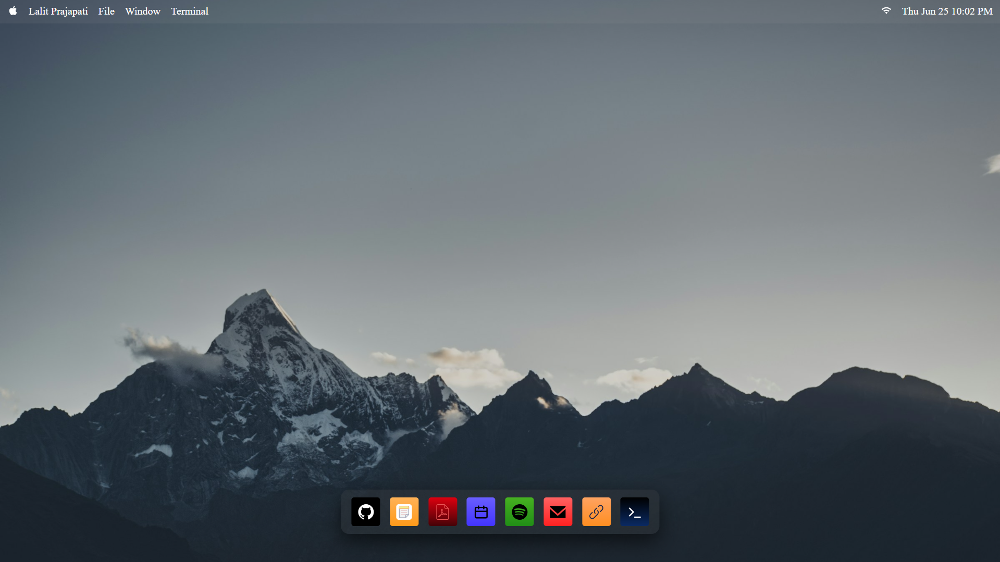
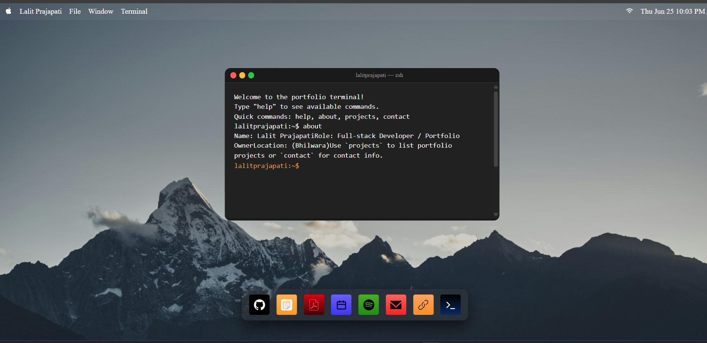
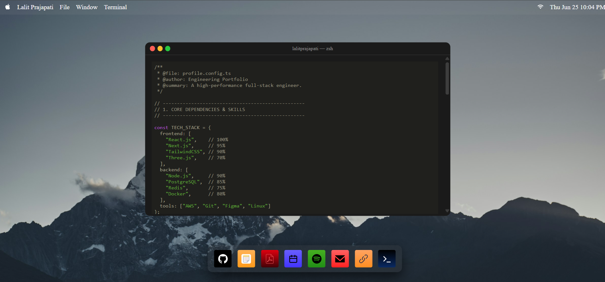
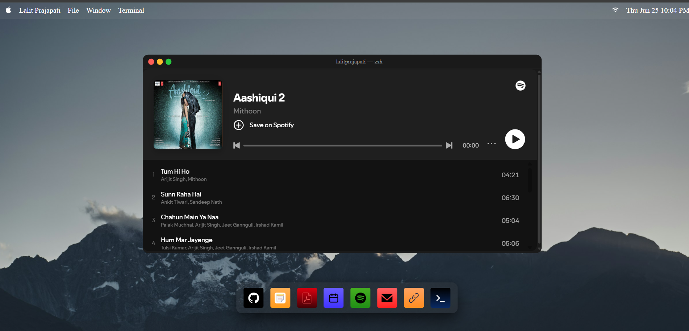

# 🚀 macOS-Inspired Portfolio

A modern **macOS-inspired portfolio** built with **React.js** that recreates the desktop experience directly in the browser.

This project features an interactive dock, draggable and resizable windows, terminal, notes app, resume viewer, Spotify integration, and smooth desktop-like interactions.

> **Live Demo:**(https://macos-portfolio-phi-two.vercel.app/)

---

## 📸 Preview


| Desktop | Terminal |
|---------|----------|
|  |  |

| Notes | Spotify |
|---------|----------|
|  |  |

---

# ✨ Features

- 🍎 macOS-inspired User Interface
- 🚀 Interactive Dock
- 🪟 Draggable Windows
- 📏 Resizable Windows
- 🕒 Live Date & Time
- 📝 Notes Application
- 💻 Interactive Terminal
- 🎵 Spotify Integration
- 📄 Resume Viewer
- 🌐 Portfolio Showcase
- 🔗 GitHub Links
- ⚡ Smooth Animations
- 📱 Responsive Design

---

# 🛠 Tech Stack

### Frontend

- React.js
- JavaScript (ES6+)
- scss
- Vite

### Libraries

- react-rnd
- react-icons
- react-console-emulator

---

# 📂 Project Structure

```
macos-portfolio-react
│
├── public
├── images
├── src
│   ├── assets
│   ├── components
│   ├── app.scss
│   └── App.jsx
│
├── package.json
├── vite.config.js
├── README.md
└── .gitignore
```

---

# 🚀 Getting Started

## Clone Repository

```bash
git clone https://github.com/Lalitprajapat47/macos-portfolio-react.git
```

## Go to Project

```bash
cd macos-portfolio-react
```

## Install Dependencies

```bash
npm install
```

## Start Development Server

```bash
npm run dev
```

Open

```
http://localhost:5173
```

---

# 📦 Build for Production

```bash
npm run build
```

Preview Production Build

```bash
npm run preview
```

---

# 📚 What I Learned

During this project I improved my understanding of:

- Structuring large React applications
- Managing multiple window states
- Building desktop-like web experiences
- Working with third-party React libraries
- Creating reusable components
- Improving frontend architecture
- Writing clean and maintainable code

---

# 🤖 AI Usage

AI was used as a development assistant for:

- Debugging
- Date & Time logic
- Terminal content generation
- Brainstorming implementation ideas

All application logic, component integration, UI customization, and project architecture were implemented manually.

---

# 🚀 Future Improvements

- Dark / Light Mode
- Calculator App
- Finder App
- Browser App
- Notification Center
- Music Player
- Wallpaper Changer
- Theme Customization
- More macOS Applications

---

# 👨‍💻 Author

**Lalit Prajapat**

📧 Email: your-email@example.com

💼 LinkedIn:
(https://www.linkedin.com/in/lalit-prajapat-019033206/?skipRedirect=true)


---

# ⭐ Support

If you found this project helpful, consider giving it a ⭐ on GitHub.

It motivates me to build more open-source projects.

---

# 📄 License

This project is licensed under the MIT License.
